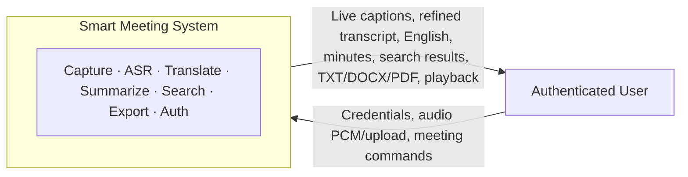
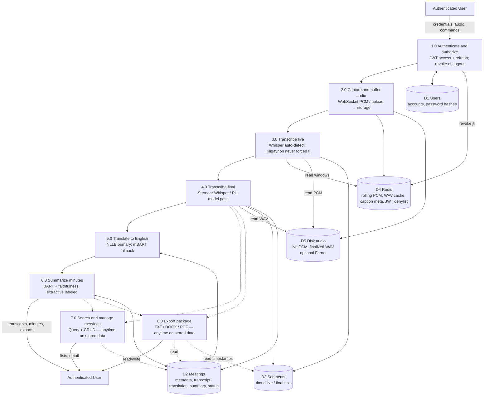

# Smart Meeting — Data Flow Diagrams (DFD)

These diagrams support **Requirements Analysis**: functional requirements are
stated as data flowing between external entities, processes, and data stores.

**Important:** The Level 1 vertical order shows a *typical single-meeting happy
path* (capture → live ASR → final ASR → translate → summarize → search/export).
**Search & manage** and **Export** do **not** wait for Summarize; they may run
on any previously stored meeting. Dashed arrows mark those non-sequential reads.

Rendered figures:

- Level 0: [`figures/smart-meeting-dfd-level0.png`](figures/smart-meeting-dfd-level0.png)
- Level 1: [`figures/smart-meeting-dfd-level1.png`](figures/smart-meeting-dfd-level1.png)

---

## Legend

| Symbol | Meaning |
|---|---|
| External entity | Actor outside the system boundary |
| Process | Transform that moves or changes data |
| Data store | Persistent or session storage |
| Solid arrow | Primary write / sequential pipeline flow |
| Dashed arrow | Read of existing stored data (any time) |

---

## Level 0 — Context diagram

Single system boundary: the **Authenticated User** exchanges inputs and outputs
with **Smart Meeting**; internal processes and stores are hidden.

**Flows (Level 0)**

| From → To | Data |
|---|---|
| User → System | Credentials / refresh token; live PCM or uploaded audio; meeting metadata; summarize / translate / search / export / logout commands |
| System → User | Access + refresh tokens; live captions; refined transcript; English translation; structured minutes (+ faithfulness / extractive flags); meeting lists; export files; audio playback |

---

## Level 1 — Major processes and stores (improved)

Corrections vs. an earlier draft:

1. **Auth** also writes the JWT denylist to **D4** (not only D1).
2. **Capture** writes **D4** (rolling Redis) **and** **D5** (disk PCM); finalized WAV on D5 may be encrypted.
3. **Live ASR** reads audio buffers and writes **D3** live segments (+ Redis caption meta).
4. **Final ASR** reads **D5**, writes **D3** final segments **and** **D2** `final_transcript`.
5. **Translate** / **Summarize** write **D2**; **Search** / **Export** **read** D2 (and Export may read D3) at any time — shown as **dashed** links.

### Process–store matrix (canonical)

| Process | Primary reads | Primary writes |
|---|---|---|
| 1.0 Authenticate | D1 Users | D1 (on signup); D4 denylist on logout/refresh rotate |
| 2.0 Capture | — | D4 rolling PCM/meta; D5 disk PCM; D5 WAV on finalize |
| 3.0 Transcribe live | D4 / D5 audio windows | D3 live segments; D4 caption meta |
| 4.0 Transcribe final | D5 WAV/PCM | D3 final segments; D2 `final_transcript` |
| 5.0 Translate | D2 transcript | D2 `translation` |
| 6.0 Summarize | D2 English (+ transcript if needed) | D2 `summary` (+ engine / faithfulness signals to client) |
| 7.0 Search & manage | D2 (any meeting) | D2 CRUD fields |
| 8.0 Export | D2 (+ D3 for timestamps) | — (file to user) |

### Requirements implied by this DFD

- Every protected flow depends on **1.0** succeeding (token in → authorized user out).
- **Original-language truth** is produced only by **3.0/4.0** into D2/D3; Translate and Summarize consume text stores, not raw audio.
- **English minutes** require **5.0 → 6.0** for a full pipeline run, but **7.0/8.0** remain available whenever D2 already holds content.
- Privacy controls appear as data-store properties: D4 denylist, D5 optional ciphertext WAV—not as a separate E2E process (still roadmap).

---

## How to use in Requirements Analysis prose

Use Level 0 to answer *who interacts with the system and with what data*.  
Use Level 1 to answer *which processes transform which flows into which stores*.  
Cite the note on non-sequential Search/Export whenever describing control flow vs. data availability.
